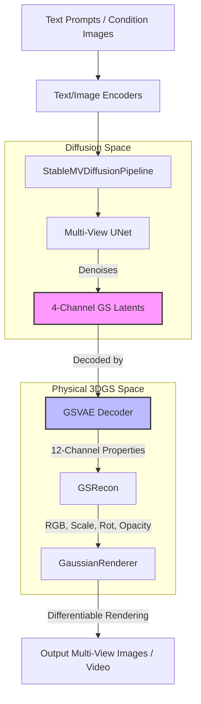
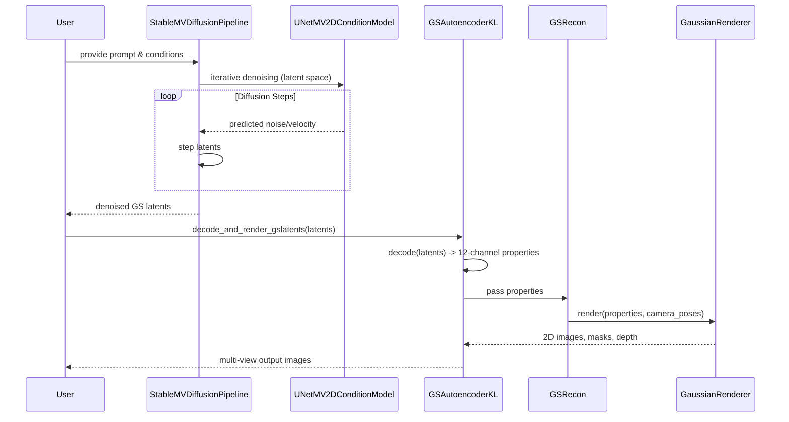

# DiffSplat: Architecture and Implementation Guide

Welcome to the internal documentation for **DiffSplat**. This guide serves as a comprehensive overview of the repository's architecture, core components, and critical implementation details, tailored for technical reviewers and new developers contributing to the codebase.

## 1. Core Components

The repository is modularly designed, separating the 3D Gaussian Splatting (3DGS) reconstruction, the encoding/decoding of 3DGS properties into latent spaces, and the diffusion processes.

### [GSRecon](https://github.com/nairrohit99/DiffSplat/blob/main/src/models/gsrecon.py#L15)
- **Role:** The foundational 3D Gaussian Splat reconstruction module. It takes multi-view images (and optionally normal/coordinate maps) and predicts per-pixel 3D Gaussian attributes (RGB, scale, rotation, opacity, depth).
- **Key Files:** [`src/models/gsrecon.py`](https://github.com/nairrohit99/DiffSplat/blob/main/src/models/gsrecon.py)
- **Mechanics:** Utilizes a Vision Transformer (ViT) backbone (defined in [`src/models/networks/attention.py`](https://github.com/nairrohit99/DiffSplat/blob/main/src/models/networks/attention.py)) with linear projection heads to decode the transformer features into explicit physical Gaussian parameters.

### [GSVAE](https://github.com/nairrohit99/DiffSplat/blob/main/src/models/gsvae.py#L33)
- **Role:** A specialized Variational Autoencoder (`GSAutoencoderKL`) modified from Stable Diffusion's VAE. It compresses the high-dimensional, 12-channel 3DGS properties (RGB, scale, rotation, opacity, depth) into a compact 4-channel latent space suitable for diffusion models.
- **Key Files:** [`src/models/gsvae.py`](https://github.com/nairrohit99/DiffSplat/blob/main/src/models/gsvae.py)
- **Mechanics:** Modifies the first input convolution and the final output convolution of a standard `AutoencoderKL` to support 12 channels instead of 3.

### [GaussianRenderer](https://github.com/nairrohit99/DiffSplat/blob/main/src/models/gs_render/gs_renderer.py#L12)
- **Role:** Differentiably renders the predicted 3D Gaussian Splats back into 2D images, depth maps, and normal maps.
- **Key Files:** [`src/models/gs_render/gs_renderer.py`](https://github.com/nairrohit99/DiffSplat/blob/main/src/models/gs_render/gs_renderer.py#L12)
- **Mechanics:** Integrates with a deferred backward pass (`deferred_bp`) backend to efficiently render physical attributes.

### Diffusion Pipelines & UNet
- **Role:** Handles the noise addition and denoising processes in the latent space. Includes customized UNet architectures (`UNetMV2DConditionModel`) capable of multi-view cross-attention.
- **Key Files:**
  - Inference: [`src/infer_gsdiff_sd.py`](https://github.com/nairrohit99/DiffSplat/blob/main/src/infer_gsdiff_sd.py#L294) (Setup of `StableMVDiffusionPipeline`)
  - Training: [`src/train_gsdiff_sd.py`](https://github.com/nairrohit99/DiffSplat/blob/main/src/train_gsdiff_sd.py#L429)

---

## 2. Key Linkages & Architecture

The system operates by linking the diffusion generation process with the physical 3DGS rendering process via the `GSVAE` latent bridge.

### Architecture Diagram
Below is the system's static architecture:

### Static vs. Runtime Relationships
- **Static Linkage:** The pipeline heavily relies on configuration states driven by [`Options`](https://github.com/nairrohit99/DiffSplat/blob/main/src/options.py#L10) to dictate whether coordinate tracking (`coord_weight`), depth tracking (`render_depth`), or LPIPS losses are attached during the computation graph construction.
- **Runtime Linkage:** During runtime, `GSRecon` produces raw 3D properties. `GSVAE` takes these via [`encode()`](https://github.com/nairrohit99/DiffSplat/blob/main/src/models/gsvae.py#L290) during training to formulate target latents, or decodes them via [`decode_and_render_gslatents()`](https://github.com/nairrohit99/DiffSplat/blob/main/src/models/gsvae.py#L264) during inference. The `GaussianRenderer` acts as the final validation layer, creating the pixel-space views to compute MSE, LPIPS, and structural similarity index (SSIM) losses.

### Sequence Diagram
This sequence diagram shows the temporal interactions during the inference phase:

---

## 3. Important Implementations

### A. Differentiable GS Rendering & Reparameterization
The transition from raw network outputs to valid 3DGS properties involves crucial activation functions to ensure physical constraints:
- **Location:** [`GSRecon.forward_gaussians`](https://github.com/nairrohit99/DiffSplat/blob/main/src/models/gsrecon.py#L141-L150)
- **Rationale:**
  - `depth`, `rgb`, `scale` are bounded using `sigmoid` and shifted to `[-1, 1]`.
  - `rotation` vectors are strictly L2 normalized using `torch.nn.functional.normalize` to represent valid quaternions.
  - `opacity` is processed via a shifted sigmoid `torch.sigmoid(opacity - 2.) * 2. - 1.` as an inductive bias to enforce initial low opacity (mitigating "floater" artifacts), heavily inspired by GS-LRM.

### B. Modified VAE for 3DGS (GSVAE)
Instead of training a decoder from scratch to map 4-channel latents to 12-channel physical properties, the implementation modifies pre-trained Stable Diffusion VAEs.
- **Location:** [`GSAutoencoderKL.__init__`](https://github.com/nairrohit99/DiffSplat/blob/main/src/models/gsvae.py#L55-L95)
- **Rationale:** The repository duplicates the weights of the first layer of the pre-trained `Conv2d` (3 channels) 4 times to create an initialization for the 12-channel input. This allows the model to leverage robust pre-trained image manifolds while instantly adapting to multi-dimensional physical properties.

### C. EDM-style Diffusion Preconditioning
The repository supports both traditional DDPM-style scheduling and EDM-style (Elucidating the Design Space of Diffusion-Based Generative Models) continuous time scheduling.
- **Location:** [`src/train_gsdiff_sd.py`](https://github.com/nairrohit99/DiffSplat/blob/main/src/train_gsdiff_sd.py#L532-L553)
- **Rationale:** In EDM-style training, instead of discrete timesteps, the model uses continuous noise levels (`sigmas`). The latents are preconditioned dynamically `noisy_latents / ((sigmas**2 + 1)**0.5)`, and the prediction targets are explicitly formulated as velocities or original samples based on the sigma configurations, yielding more numerically stable training at high resolutions.
